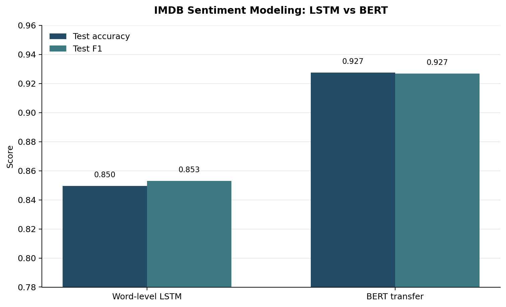
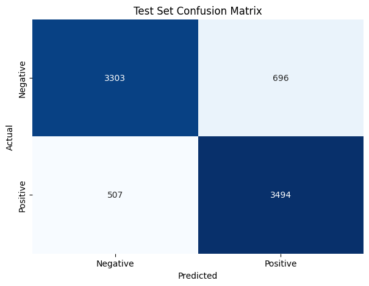
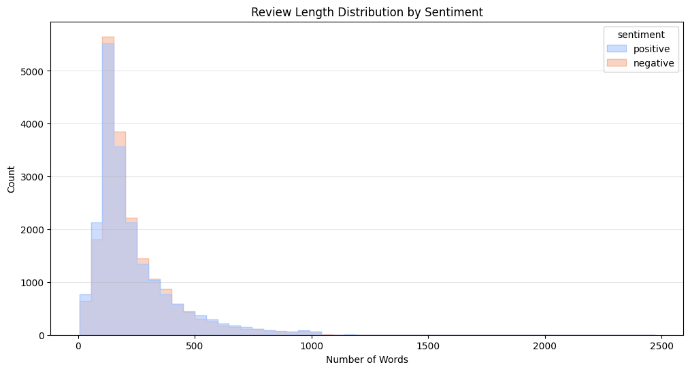

# Movie Review Sentiment with LSTM and BERT

Natural-language processing workflow for IMDB movie-review sentiment classification using word-level LSTMs and BERT transfer learning.

 [GitHub Repo](https://github.com/DDaswE/movie-review-sentiment-lstm-bert)

> Opening this notebook in Colab creates a working copy. The source notebook in GitHub remains unchanged unless a user already has write access to this repository.

## Preview

**Figure 1.** Test-set comparison between the word-level LSTM baseline and the BERT transfer-learning model.

**Figure 2.** LSTM confusion matrix on the held-out IMDB test set.

**Figure 3.** Review-length distribution by sentiment label after text preprocessing.

## Project summary

This project compares recurrent neural networks and transformer-based transfer learning for binary sentiment classification. The first part builds a word-level LSTM pipeline for IMDB reviews, including cleaning, tokenization, padding, batching, training, tuning, and error analysis. The second part fine-tunes BERT-based classifiers and compares their accuracy, precision, recall, F1 score, and misclassification behavior against the LSTM model.

## Problem

This project aims to build neural models for sequential movie-review text:

> Build a recurrent neural network to work with movie review data and identify reviewer sentiment. The workflow includes text cleaning, tokenization, word-level recurrent modeling, batching with a DataLoader, and applying pretrained models for transfer learning in NLP.

The transfer-learning section uses pretrained BERT embeddings to improve positive/negative review classification, then compares BERT against the LSTM baseline through test metrics, misclassification analysis, and external Rotten Tomatoes reviews.

## Data

- IMDB Movie Review Dataset
- binary sentiment labels: positive and negative
- 60/20/20 train/validation/test split
- 24,000 training reviews, 8,000 validation reviews, and 8,000 test reviews
- additional external audience reviews from Rotten Tomatoes for out-of-distribution evaluation

## Techniques

- text cleaning and tokenization
- review-length summary statistics and distribution analysis
- sequence padding to length 500 for LSTM experiments
- PyTorch `Dataset` and `DataLoader` batching
- word-level LSTM sentiment classifier
- hyperparameter tuning across optimizer and architecture choices
- BERT tokenizer and `bert-base-cased` transfer learning
- pooled-output and hidden-state classifier variants
- precision, recall, F1, and confusion-matrix evaluation
- false-positive and false-negative error analysis
- character-level LSTM bonus experiment

## Achievements

- built a full word-level LSTM pipeline for IMDB sentiment classification
- tuned at least four LSTM hyperparameters, including non-optimizer architecture choices
- evaluated LSTM errors through full-text false positive and false negative examples
- reported 84.96% LSTM test accuracy on the IMDB test split
- fine-tuned BERT-based sentiment classifiers and compared configurations such as learning rate, maximum sequence length, and frozen layers
- achieved 92.75% BERT test accuracy, outperforming the LSTM baseline
- compared model-level precision, recall, and F1 across train, validation, and test splits; BERT reached 0.9268 test F1
- tested both LSTM and BERT on external Rotten Tomatoes reviews for `Captain America: Brave New World`
- implemented a bonus character-level LSTM experiment and improved its test accuracy from 50.20% to 72.14% through language-model fine-tuning and representation changes

## Repository structure

| File | Role |
| --- | --- |
| `EdwinXuA4.ipynb` | Main NLP notebook with LSTM, BERT, evaluation, and bonus experiments |
| `EdwinXuA4.html` | Rendered notebook report |
| `preview_model_comparison.png` | LSTM vs BERT test accuracy and F1 comparison |
| `preview_lstm_confusion_matrix.png` | LSTM test-set confusion matrix |
| `preview_review_length_distribution.png` | Review-length distribution by sentiment |

## Skills practiced

This project practices NLP preprocessing, recurrent neural networks, BERT transfer learning, transformer tokenization, sequence batching, model tuning, classification metrics, error analysis, and out-of-distribution evaluation.
